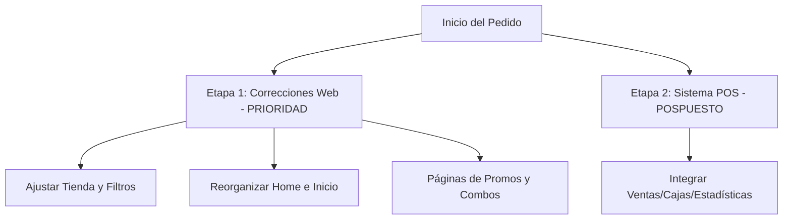

# Análisis End-to-End: Pedido del Cliente (chatNicoCliente)

Este documento contiene la transcripción y el análisis completo del pedido de tu cliente a partir de los audios y bocetos enviados por WhatsApp.

---

## 📈 Resumen Ejecutivo y Prioridades

> [!IMPORTANT]
> **La Prioridad Inmediata son las CORRECCIONES WEB.**
> El cliente está lanzando una campaña de marketing y necesita prioritariamente los cambios de diseño y maquetación.
> **El sistema de ventas POS queda pospuesto** para una segunda etapa cuando el cliente complete el pago pendiente.

---

## 🎧 Transcripción de los Audios

### 1. Audio 1 (`audio1.wav` / 7 de Mayo)
> *"Buen día amigo cómo vas todo bien Che te tengo que pasar unas correcciones de la página porque contraté una loca de marketing y bueno me hice unas correcciones ahí para que quede mejor ahora te voy a pasar a ver si entendés más o menos"*

### 2. Audio 2 (`audio2.wav` / 9 de Mayo)
> *"Qué onda amigo Buen día Todo bien Che boluda Mira acá te pasé un sistema que justo estaba mirando de tiktok y no apareció que está bueno boludo es medio como lo que yo te había pasado viste que pasa que lo que yo necesitaría básicamente por ahí puede ser que no concretamente O sea tal cual pero es más o menos a órdenes y el tema el sistema post o sea de ventas ahí solo te pasé un video que yo más o menos mostrando todo lo que tiene y te paso el link por la duda si quieres verlo podés poner registrarte poner tu correo y eso no te voy a pagar nada te da 15 días de prueba por si quieres verlo bien a fondo vos Pero se ve Está bueno algo así quisiera ser yo y usted es como te dije la otra vez que te pase los videos viste o sea que yo tenía el sistema y el otro o sea que tenga básicamente las las dos cosas o sea todo lo que las órdenes y el sistema de venta o sea Fox [POS] que sería la venta abrir cajas ahora cajas todos los indicadores estadísticas y todas esas cosas así como tiene este este Está bueno boludo algo así estaría buenísimo para incluir como lo que habíamos hablado dentro que esté conectado con la página no"*

### 3. Audio 3 (`audio3.wav` / 25 de Mayo)
> *"Qué onda amigo Cómo va todo bien Todo bien cómo va todo por ahí la facu todo en orden eso Che bola escúchame cuando puedas eh si puedes hacerme lo que te había dicho al menos eso es lo de la corrección viste más para porque estoy haciendo toda una campaña de marketing viste y bueno después lo del sistema eso lo vemos ahora cuando cobre ya te voy a terminar de pagar todo lo que falta así ya después hacemos lo otro"*

---

## 📐 Detalle de los Bocetos (Imágenes)

### 🛍️ Boceto 1: Sección Tienda y Filtros
*(Basado en [WhatsApp Image 2026-05-07 at 8.20.43 AM.jpeg](file:///c:/Users/Gime/Downloads/chatNicoCliente/WhatsApp%20Image%202026-05-07%20at%208.20.43%20AM.jpeg))*

*   **Estructura Superior**: Botones de acceso rápido para **"PROMO"** y **"COMBOS"**.
*   **Barra Lateral de Filtros (Desktop)**: Categorías a incluir:
    *   *Smart* (Celulares/Smartphones)
    *   *Auris* (Auriculares)
    *   *Cable*
    *   *Carga*
    *   *Comput.* (Computación)
    *   *C. Auto* (Carga/accesorios de auto)
*   **Grilla de Productos**:
    *   **Comportamiento Mobile ("Celular")**: Mostrar de **2 a 3 tarjetas de producto por fila** (¡muy importante para la vista móvil!).
    *   **Contenido de las Tarjetas**:
        *   Foto del producto.
        *   Título.
        *   Precio.
        *   Indicador de descuento (si tiene o no descuento).
        *   Mantener la acción de clic tal cual está implementada actualmente.
*   **Navegación / Flujo**:
    *   **"Tienda primero / Inicio sacarlo"**: Al ingresar, el usuario debe caer directo en la Tienda (hacer de la tienda la página principal o remover el botón de "Inicio" tradicional para priorizar la compra directa).
    *   **Banners**: Revisar los enlaces de los banners para que redirijan a lo que cada banner propone, y configurar/controlar el tiempo de transición en pantalla de los banners (slider).
    *   **Botones**: Hacer una revisión general de que todos los botones de la tienda funcionen correctamente.

---

### 🏠 Boceto 2: Reorganización de la Página de Inicio / Servicios
*(Basado en [WhatsApp Image 2026-05-07 at 8.20.43 AM (1).jpeg](file:///c:/Users/Gime/Downloads/chatNicoCliente/WhatsApp%20Image%202026-05-07%20at%208.20.43%20AM%20%281%29.jpeg))*

*   **Header / Destacados**: Poner bien visible la propuesta de valor con tres pilares: **Garantía**, **Rapidez** y **Profesionalismo**.
*   **Sección de Servicios**:
    1.  *Rep. de Cel. Cons.* (Reparación de Celulares y Consolas).
    2.  *Manteni.* (Mantenimiento).
    3.  *Rep. de Comp.* (Reparación de Computadoras).
    4.  *Armado* (Armado de PCs a medida).
    5.  *Sist. de Seg.* (Sistemas de Seguridad / Cámaras).
    6.  *Serv. Téc.* (Servicio Técnico General / banner de llamado a la acción).
*   **Sección Contactanos**:
    *   **Columna Izquierda**: Datos de contacto (WhatsApp, Dirección, Email).
    *   **Columna Derecha**: Mapa interactivo o imagen con enlace a la ubicación (MAPA).

---

### 🏷️ Boceto 3: Páginas de Promociones y Combos
*(Basado en [WhatsApp Image 2026-05-07 at 8.20.44 AM.jpeg](file:///c:/Users/Gime/Downloads/chatNicoCliente/WhatsApp%20Image%202026-05-07%20at%208.20.44%20AM.jpeg))*

*   **Página "Promos"**:
    *   Título de la sección.
    *   Medios de pago disponibles.
    *   Las tarjetas/productos que corresponden a la promoción activa.
*   **Página "Combos"**:
    *   Mismo diseño y estructura que la página de Promos, pero mostrando los combos de productos agrupados.

---

## 🏪 Detalle del Sistema de Ventas POS (Pospuesto para la Etapa 2)
*(Basado en [Captura.JPG](file:///c:/Users/Gime/Downloads/chatNicoCliente/Captura.JPG) y el audio del 9 de Mayo)*

El cliente quiere un sistema tipo **POS (Point of Sale)** integrado, tomando como referencia el sitio de [ReparaPOS](https://reparapos.com).
*   **Funcionalidades del POS**:
    *   Control de órdenes de reparación y trabajo.
    *   Sistema de ventas directa (POS).
    *   Apertura y cierre de caja.
    *   Indicadores comerciales y paneles de estadísticas.
    *   **Integración**: Debe estar conectado directamente con la página web de la tienda.
